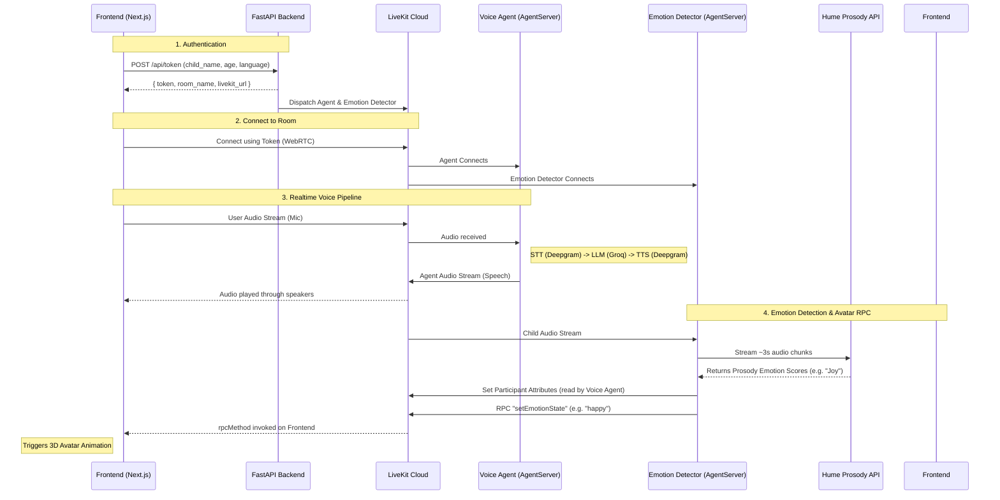

# Sakhi Voice Agent: Architecture Overview

This document describes the architecture of the Sakhi MVP voice agent, focusing on how the frontend and backend interact via LiveKit.

## Core Components

1.  **Frontend (Next.js)**: Handles the UI, microphone/speaker access, and 3D avatar rendering.
2.  **Backend (FastAPI + LiveKit Agents + Hume)**:
    *   **FastAPI**: Serves the `POST /api/token` endpoint to authenticate children and generate LiveKit room tokens. Dispatches both the voice agent and the emotion detector.
    *   **Voice Agent**: The Python process that connects to the LiveKit room, listens to the child's audio, talks back, and uses short-term memory to adjust its tone based on the child's emotion.
    *   **Emotion Detector**: A separate "programmatic participant" that silently joins the room, streams the child's audio to the Hume Prosody API, injects emotion data into the voice agent's context, and triggers frontend avatar animations.
3.  **LiveKit Cloud**: The WebRTC infrastructure that routes realtime audio, video, and data (RPC) between the frontend and the backend components.

## Architecture Diagram

## How the Voice Pipeline Works

The Python agent uses the LiveKit Agents SDK. The frontend React SDK (`@livekit/components-react`) automatically handles capturing the microphone and playing the agent's audio output.

1.  **Speech-to-Text (STT)**: Deepgram (`nova-3`, multilingual).
2.  **Language Model (LLM)**: Groq (`llama-3.1-8b-instant`). The system prompt is personalized using the child's profile parsed from the token metadata. It also receives short-term emotional context from the Emotion Detector.
3.  **Text-to-Speech (TTS)**: Deepgram (`aura-2-asteria-en`, English).
4.  **Voice Activity Detection (VAD)**: Silero VAD (knows when the child starts and stops speaking).
5.  **Turn Detection**: LiveKit `MultilingualModel` (handles conversational turn-taking).

## Frontend Responsibilities

To integrate with the backend, the frontend Next.js application must:
1.  **Fetch a Token**: Call `/api/token` with the child's details before trying to connect to LiveKit.
2.  **Connect to LiveKit**: Use the `<LiveKitRoom>` React component provided by `@livekit/components-react`, passing in the `serverUrl` and `token`.
3.  **Render the Voice UI**: Inside `<LiveKitRoom>`, use `<VoiceAssistantControlBar>` to enable the microphone and `<RoomAudioRenderer>` to automatically play the agent's voice.
4.  **Listen for RPC (Avatar Animations)**: Register a listener for the `setEmotionState` RPC method on the local participant. When the backend detects an emotion, play the corresponding 3D avatar animation. See `api_contract.md` for payload details.
